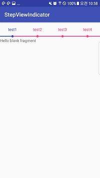
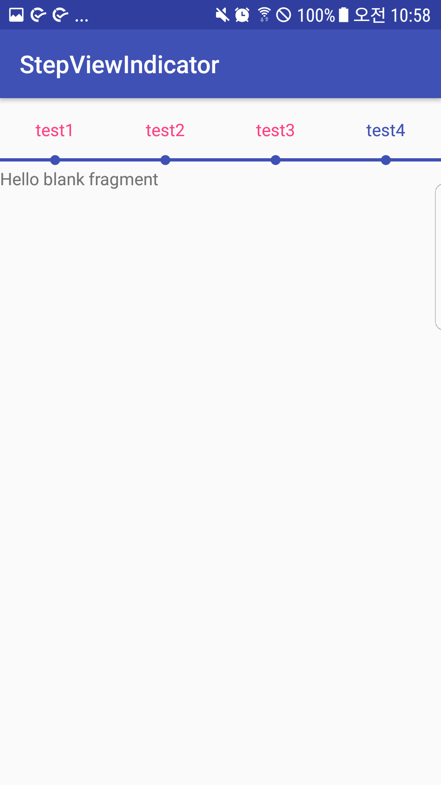

# Android-StepViewIndicator
 

## Install

add your build.gradle
```
allprojects {
    repositories {
        jcenter()
        maven { url "https://jitpack.io" }
    }
}

dependencies {
  implementation 'com.github.KimKyung-man:Android-StepViewIndicator:v1.0.0'
}
```

  
## Usage
layout.xml
```
<xyz.gracefulife.stepindicator.StepsView
    android:id="@+id/indicator_steps"
    android:layout_width="match_parent"
    android:layout_height="56dp"
    android:visibility="visible" />
```        

SomeActivity.java
```
indicatorSteps.setLabels(new String[]{"test1", "test2", "test3", "test4"})
    .setProgressColorIndicator(ContextCompat.getColor(this, R.color.colorPrimary))
    .setBarColorIndicator(ContextCompat.getColor(this, R.color.colorAccent))
    .setCompletedPosition(1)
    .drawView();
```

## Improvements
the original version is https://github.com/anton46/Android-StepsView.

## License
Apache 2.0
